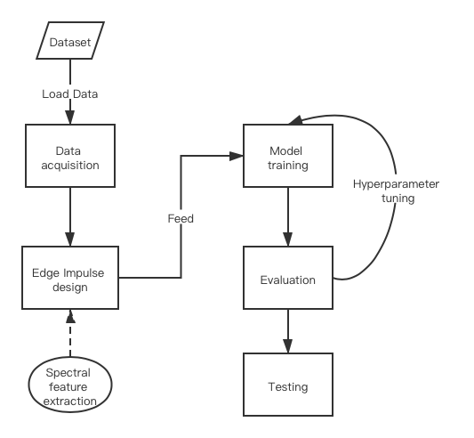
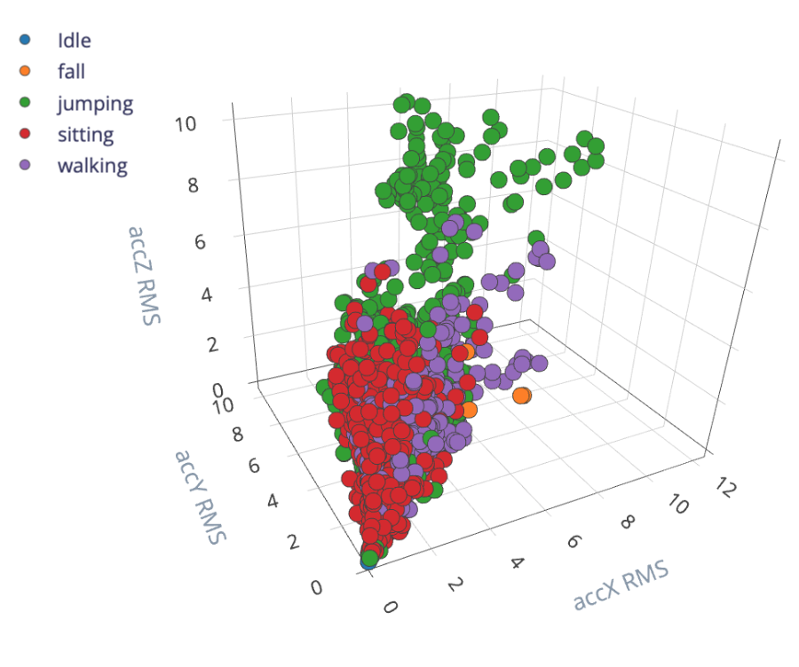
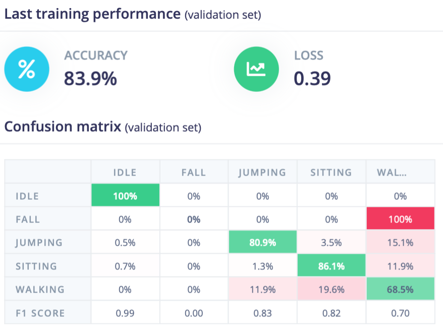
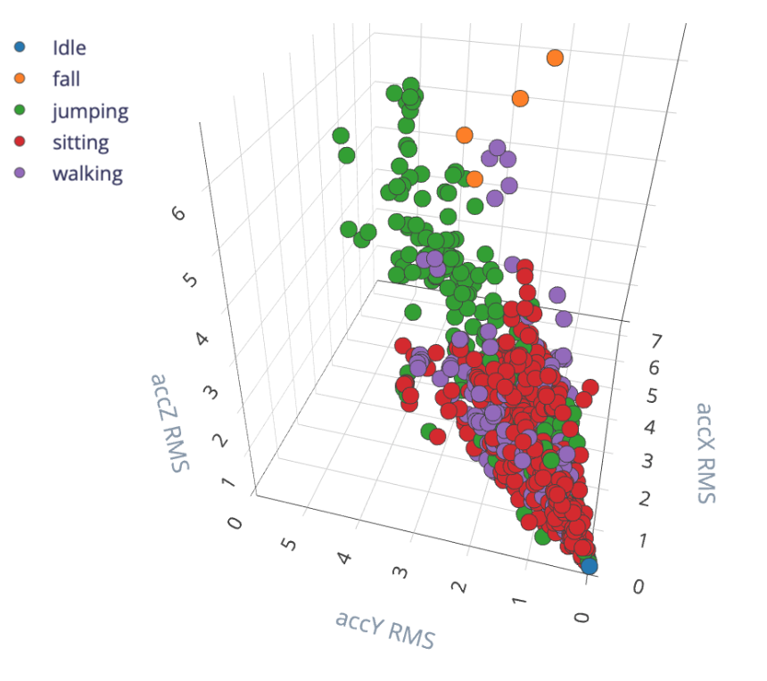
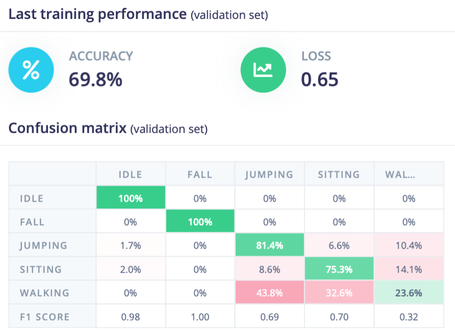

# Falling detection on Arduino using neural network
Author: Bokun Kong

Link to github repo: [falling detection]( https://github.com/Rayyyk/falling-detection)

## Introduction
In this study, deep learning models are designed and trained to develop gesture recognition system on mobile devices. I intend to recognize falling motion with Arduino Nano 33 BLE sense by using the embedded neural network provided in a cloud artificial intelligence platform Edge Impulse. Embedded neural network is trained based on Keras in Edge Impulse, which will be modified for better model performance, and results will be compared.

For the over-65 population, falling can be a serious health risk. According to the CDC (centers for disease control and prevention), three million the elderly people each year are treated in emergency rooms for fall-related injuries, and one in four older adults falls each year (Lai, et al., 2010). Recently, the digital health community has paid more attention on creating methods to detect and even prevent falls in a proactive way. Fall detection has become an important milestone in the research of physical posture recognition — which is to train an AI system to automatically classify general actions such as sitting down, walking, jumping and falling.

Among all falling monitoring related literatures, the falling detection system can be divided into two categories. First, it detects falling using visual sensors, or acoustic sensors (Popescu, Li, Skubic, and Rantz, 2008). Secondly, sensors such as 3D accelerometer and gyroscope are used to monitor falling posture (Perry, 2009; Narayanan, 2007).

## Research Question
In this research, the research question is: Can we develop an embedded AI application for elderly-falling detection with mobile sensors such as Arduino using neural network models.

## Application Overview
In order to make a falling posture detection application with mobile sensors, following building blocks are considered in this project: data acquisition, edge impulse design, model training, evaluation, and testing. The Flow chart of this project shown at below.

In this research, the system is designed to identify five types of motion postures: walking, jumping, sitting down, falling, and idle. Motion gesture dataset will be collected through Edge Impulse platform, and then feature extraction process will be conducted. Among various feature extraction methods such as flatten, image, audio, in falling detection analysis, spectral analysis is conducted in feature processing block. Since it is great for analyzing repetitive motion, such as data from accelerometers, which extracts the frequency and power characteristics of a signal over time. Then neural network learning block will be used, which learns to distinguish between these five types of motion gestures by taking these spectral features. The classification model performance is evaluated by loss and accuracy on training and validation dataset. Hyperparameters are tuned according to model performance on validation dataset.

## Data
Data is collected using microcontroller Arduino through Edge Impulse platform. In this research, raw data is collected considering five motion gesture classes including walking, jumping, sitting down, falling, and idle. Motion posture can be recorded using built-in accelerometer in microcontroller Arduino. More specifically, raw data is recorded according to three dimensions of accelerometer with predefined frequency in a certain time period. Machine learning training requires large datasets to achieve satisfiable model performance, therefore, the motion posture data is recorded for a relatively long time 5 minutes for all motion gesture class except for falling. Repetitive motion postures are recorded in those 5 minutes datasets, which enrich the diversity of that corresponding motion posture. However, falling raw data is collected separately with 2 seconds recording per dataset containing one falling motion, which simulates falling motion more accurately than using continuous dataset.

## Model
As for spectral feature model, various parameter sets are compared to achieve better feature extraction performance. The results of the digital signal processing can be evaluated by three graphs: After filter, Frequency domain, and Spectral power. A good signal processing block will yield similar results for similar data. In filter session, several parameters are compared such as cut-off frequency which is the frequency either above or below which the power output, type of filter including low-pass filter and high-pass filter.

In neural network training session, various neural network architectures are compared using different neural network layers such as dense layer, dropout layer. Hyperparameters such as learning rate, epochs are also tuned according to accuracy on validation set.

## Experiments and Results

In terms of spectral feature extraction session, it appears that low-pass filter keeps more general features than high-pass filter. When cut-off frequency is 3 and order is 6, the digital signal processing result performs best, since the result have the most similar features for similar raw data. The digital signal processing result of the dataset is shown in a three-dimensional space at below, which provide the insight of feature distributions of various motion categories.

Regarding to neural network training session, I initialise the model with two hidden layers with 20, 10 nodes respectively. The accuracy and loss on validation sets is 83.9% and 0.39 as we can see at below.

Noticing that in the confusion matrix falling motion category accuracy is 0, which might because the feature of falling category is not obvious, and it might be similar to walking category. Therefore, filter type is changed to high-pass filter back in feature extraction session, to extract more detail information for model training, and the feature distribution using high-pass filter shows at below.

The corresponding classification result shows at below. Although the accuracy on validation set is decreased to 69.8%, the falling motion category accuracy is 100%.

Regarding to neural network architectures, convolutional neural networks are aborted, since the data input is simple, with only 33 features in one-dimensional list. Therefore, dense layers and dropout layers are modified and compared in this research. Various dense layer with various number of nodes, and dropout layer are compared. The result at below illustrates that complicated neural networks have relatively good performance.

| Model | Accuracy | Dense1 | Dense2| Dense3 | Dropout |
| :-----:| :-----: | :-----: | :-----: | :-----: | :-----: |
| model1 | 69.8% | 20 | 10 | NAN| NAN
| model2 | 75.7% | 200 | 50 | NAN | 0.1
| model3 | 80.3% | 1000 | 200 | 50 | 0.1

Hyperparameters are also tuned, and the accuracies on validation sets are listed at table below. It is noticeable that the model performs well on parameter set: epoch 40, lr 0.0005, min conf 0.5.

| Model | Accuracy | Epoch | Learning rate | min. confidence rating |
| :-----:| :-----: | :-----: | :-----: | :-----: |
| model1 | 80.3% | 20 | 0.0005 | 0.6 |
| model2 | 82.7% | 40 | 0.0005 | 0.6 |
| model3 | 81.9% | 40 | 0.001 | 0.6 |
| model4 | 82.1% | 40 | 0.0005 | 0.5 |

Finally, the program is deployed to microcontroller Arduino through Edge Impulse platform. This makes the model run without an internet connection, minimizes latency, and runs with minimal power consumption.

## Bibliography
Lai, C.F., Huang, Y.M., Park, J.H. and Chao, H.C., 2010. Adaptive body posture analysis for elderly-falling detection with multisensors. IEEE Intelligent Systems, 25(02), pp.20-30.

Narayanan, M.R., Lord, S.R., Budge, M.M., Celler, B.G. and Lovell, N.H., 2007, August. Falls management: detection and prevention, using a waist-mounted triaxial accelerometer. In 2007 29th Annual International Conference of the IEEE Engineering in Medicine and Biology Society (pp. 4037-4040). IEEE.

Perry, J.T., Kellog, S., Vaidya, S.M., Youn, J.H., Ali, H. and Sharif, H., 2009, December. Survey and evaluation of real-time fall detection approaches. In 2009 6th International Symposium on High Capacity Optical Networks and Enabling Technologies (HONET) (pp. 158-164). IEEE.

Popescu, M., Li, Y., Skubic, M. and Rantz, M., 2008, August. An acoustic fall detector system that uses sound height information to reduce the false alarm rate. In 2008 30th Annual International Conference of the IEEE Engineering in Medicine and Biology Society (pp. 4628-4631). IEEE.

## Declaration of Authorship
I, Bokun Kong, confirm that the work presented in this assessment is my own. Where information has been derived from other sources, I confirm that this has been indicated in the work.
Bokun Kong
25/06/2021
